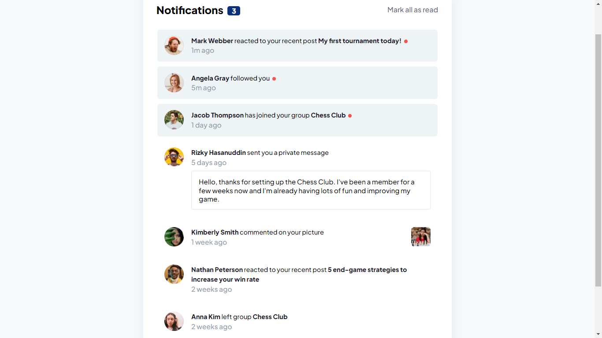

# Frontend Mentor - Notifications page solution

This is a solution to the [Notifications page challenge on Frontend Mentor](https://www.frontendmentor.io/challenges/notifications-page-DqK5QAmKbC). Frontend Mentor challenges help you improve your coding skills by building realistic projects. 

## Table of contents

- [Overview](#overview)
  - [The challenge](#the-challenge)
  - [Screenshot](#screenshot)
  - [Links](#links)
- [My process](#my-process)
  - [Built with](#built-with)
  - [Continued development](#continued-development)
- [Author](#author)

## Overview

### The challenge

Users should be able to:

- Distinguish between "unread" and "read" notifications
- Select "Mark all as read" to toggle the visual state of the unread notifications and set the number of unread messages to zero
- View the optimal layout for the interface depending on their device's screen size
- See hover and focus states for all interactive elements on the page

### Screenshot

### Links

- Solution URL: [Repo](https://github.com/FMChallenges/notifications-page)
- Live Site URL: [Live](https://fmchallenges.github.io/notifications-page/)

## My process

### Built with

- Semantic HTML5 markup
- CSS custom properties
- Flexbox
- CSS Grid
- Javascript

### Continued development

Well, my idea has always been and will be to improve all the knowledge acquired, and obviously I am going to improve this challenge.

## Author

- Website - [Portfolio](https://joelmiguelvalente.github.io/porfolio/)
- Frontend Mentor - [@joelmiguelvalente](https://www.frontendmentor.io/profile/joelmiguelvalente)
- Discord - [@Miguel92](https://discord.com/users/465203938900049920)
- Linkedin - [@joelmiguelvalente](https://www.linkedin.com/in/joelmiguelvalente)
- Twitter - [@JvalenteM92](https://www.twitter.com/JvalenteM92)
